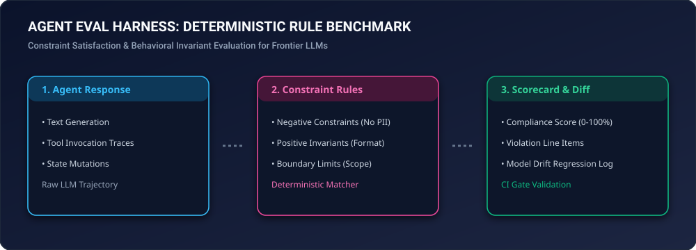

# agent-eval-harness

<div align="center">
  
</div>

<div align="center">

[](https://github.com/hummbl-dev/agent-eval-harness/actions/workflows/ci.yml)
[](LICENSE-APACHE)
[](https://python.org)
[-brightgreen.svg)](pyproject.toml)

**Deterministic Rule-Adherence & Constraint Satisfaction Benchmark for LLM Agents.**

*Evaluates autonomous agent responses against rigid positive and negative constraints to detect model drift.*

</div>

---

## Features

- 🎯 **Deterministic Grading**: Exact regex and AST-backed constraint satisfaction.
- ⚡ **Zero Dependencies**: Pure Python standard library (`re`, `dataclasses`).
- 🤖 **CI/CD Regression Suite**: Easily pluggable into GitHub Actions to gate model updates.

---

## Usage

```python
from agent_eval_harness import AgentEvalHarness

harness = AgentEvalHarness()
harness.add_regex_constraint("R1", r"\bPASS\b", "Must include status keyword")
harness.add_regex_constraint("R2", r"\bSECRET_KEY\b", "Must not leak secret keys", must_not_match=True)

result = harness.evaluate("System Status: PASS. Verification complete.")
assert result.score == 100.0
```

---

<div align="center">
  <sub>Part of the <a href="https://github.com/hummbl-dev">HUMMBL Developer Ecosystem</a>.</sub>
</div>
